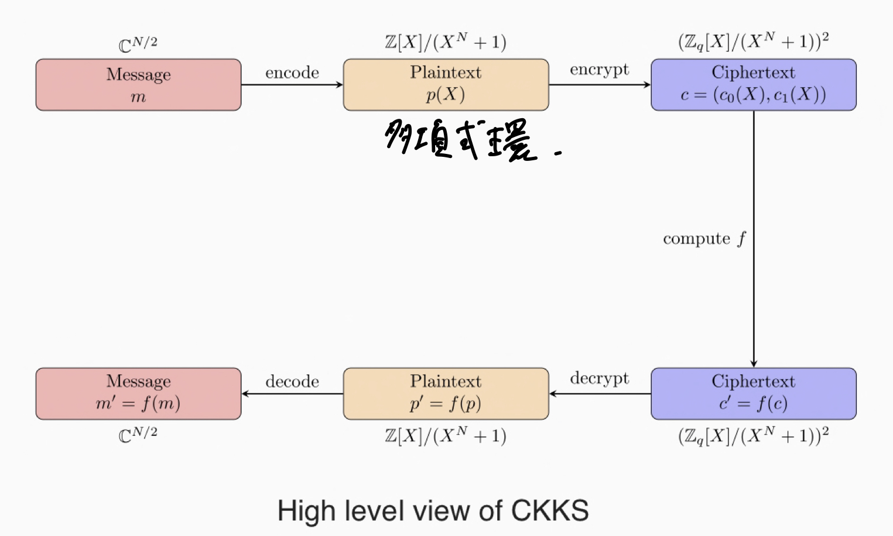

# FHE (Fully Homomorphic Encryption)
整数環上のFHEを考えることで、FHEの外観を追ってみる。  

まず、$m = {0, 1}$という1bitのメッセージを暗号化する

$Z_p$ (mod p の整数環)上のオペレーションで隠されている必要がある。

$r << p$ となるノイズを付与して、

$$

C(m) = m + 2r + qp

$$

として暗号化を定義する。  
復号は、mod p と mod 2をとって

$$

D(C(m)) =  ((m+2r+pq) \% p) \%2 \\
  = (m + 2r) \% 2 \\
  = m

$$

足し算は

$$

C(m_1) + C(m_2) = m_1 + m_2 + 2(r_1 + r_2) + p(q_1 + q_2)

$$

掛け算は

$$

C(m_1) C(m_2) = m_1 m_2 + 2(r_2m_1 + r_1m_2 + r_1r_2) + p(m_1q_2 + 2r_1 q_2 + q_1 m_2 + 2 q_1 r_2 + q_1q_2 )

$$

掛け算の場合、ノイズはより大きくなる  
ノイズがない場合は攻撃者は二つの暗号文の最大公約数を求めるだけで攻撃ができてしま
う。  

$$ 

gcd(C(m1), C(m_2)) = gcd(m_1 + pq, m_2 + pq) ????

$$

## LWE (Learing with error)
- $A$ : random uniform matrix  
- $e$ : small integer vector error
- $s$: secret vector
- $b$: $s A + e$

$b$から$s$を求めるのは、$A$が分かっていたとしても困難  

## ノイズの増大
ノイズは処理を繰り返すことで大きくなってしまう。  

ex.)
- $m = 0$
- $r = 5$
- $p = 29$ : secret key
- $q = 68$

mを暗号化すると、
$$

C_p(0) = 0 + 2 \times 5 + 68 \times 29
= 1982

$$

続いて、復号を行うと
$$
Dec(C_p(0)) = (1982 \% 29 )\%2 = 10 \% 2 = 0
$$

でmに等しくなる。  

では、3回$C_p(0)$を足すとどうなるか、

$$

C_p(0) + C_p(0) + C_p(0) = 5946 \\
 = 0 + 2 \times 15 + 204 \times 29  \\
 = 1

$$

となり、mが1になってしまった。  
これは $2r = 30$ が $p = 29$ よりも大きくなっていしまったことで、暗号文が機能しなくなってしまったためである。

$\rightarrow$ これに対処するのがBootstrap (難しいのでスキップ...)


# Cheon-Kim-Kim-Song (CKKS) Scheme 

続いて、CKKSの説明へ移る。




CKKSでは、複素数のベクトルの計算が可能となる。  図のように、メッセージは平文の多項式にエンコードしてから、暗号化される。  

CKKSでは、掛け算、足し算、そしてベクトルのローテーション(rotではないので注意, [1,2,3]を[2,3,1]とするずらすような処理)ができる。  


# CKKS Encoding
CKKSでは、整数多項式環を平文および暗号空間として用いる。しかし、実用上はベクトルが扱える方がよい。そこで、入力ベクトル$ z \in \mathcal{C}^{N/2} $ を多項式空間 $m(X) \in \mathcal{Z} / (X^N + 1) $ にエンコードする。  

ここで、
$N$をPolynominal degree modulusの次元数として定義する。(ただし、Nは2の累乗)  
ここでm次の円分多項式(Cyclotomic Polynominal)を$\Phi_M (X) = X^N + 1$として書く  

平文空間は多項式環$\mathcal{R} = \mathcal{Z}(X) / (X^N + 1)$となる。  
 $\xi_M$ を1のM乗根 $\xi_M = e^{2i\pi/M}$
とする

## Vanilla Encoding
まず、シンプルな例として 
$z \in \mathcal{C}^N $  を 多項式$m(x) \in \mathcal{C}[X] / (X^N + 1)$ にエンコードすることを考える。  

そのために、埋め込み(Canonical embedding) $\sigma$ : $\mathcal{C}[X] / (X^N + 1) \rightarrow \mathcal{C}^N$を考える。  

多項式 $m(X)$ をベクトル $z$ にデコードするために、多項式を円分多項式 $\Phi_M(X) = X^N + 1$ の根として評価を行う。この N個 の根は $\xi, \xi^3, ..., \xi^{2N-1}$となる。  

なので、$m(X)$のデコードは  

$$

\sigma (m) = (m(\xi), m(\xi^3), ..., m(\xi^{2N - 1})) \in \mathcal{C}^N \\

$$
(それぞれの$\xi^i$について多項式に代入していく。)

ただし、$\sigma$は同型写像とする。  
これにより、あらゆるベクトルはユニークに対応する多項式にエンコードすることができる。

トリッキーな部分としては、ベクトル $z \in \mathcal{C}^N$ を対応する多項式にエンコードする、つまり $\sigma ^ {-1}$ を考える場合である。  

$$

m(X) = \sum_{i=0}^{N-1} \alpha_i X^i \in \mathcal{C}[X] / (X^N + 1)

$$

をベクトル $z \in \mathcal{C}^N$ が与えられた場合に、 $ \sigma (m) = (m(\xi), m(\xi^3), ..., m(\xi^{2N - 1})) = (z_1, ..., z_N) $ という条件下で考えるということである。

最終的には

$$

\sum_{j=0}^{N-1} \alpha_j(\xi^{2i - 1})^j = z_i, i=1, .., N

$$

となる。これは線形関数として見られる:

$A\alpha = z$、Aは $(\xi^{2i-1})_{i=1,...,N}$ についてのVandermonde matrix、$\alpha$はploynomilal coefficientsのベクトル、$z$はエンコード対象のベクトルとなる。  

ゆえに、$\alpha = A^{-1}z$、

$$
\sigma^{-1}(z) = \sum_{i=0}^{N-1}\alpha_iX^i \in \mathcal{C}[X]/(X^N+1)
$$

## Example
$M=8, N=M/2=4, \Phi_M(X) = X^4 + 1, \omega=e^{\frac{2i\pi}{8}} = e^{\frac{i\pi}{4}}$とする。  
ゴールはベクトル$[1, 2, 3, 4]$と$[-1, -2, -3, -4]$をエンコード、デコード、多項式上で足し算掛け算してデコードすることである。  

8次の円分多項式なので、1の8乗根を考えればいい。

$$
\xi_M = \omega = e^\frac{i\pi}{4}
$$
となるものである。

以上により $\sigma$と$\sigma^{-1}$が定義できるので、実装してみよう。


```

```


